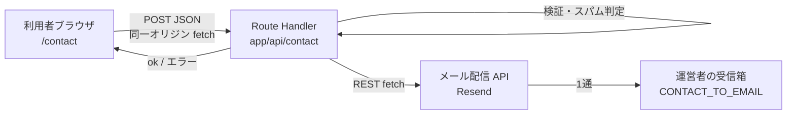

# お問い合わせフォーム 設計

KurashiMap に一般利用者向けのお問い合わせフォームを設ける。利用者はサイト上のフォームから送信し、内容は**運営者のメールボックスにメールで届く**。サイト側にはデータベースを持たず、問い合わせ内容を永続化しない。

現状 `/about` の「運営」節には「データの誤りにお気づきの場合はご指摘ください」と書きながら**連絡手段が存在しない**。本設計はその穴を塞ぐことを第一目的とする。

---

## 1. 全体構成



- 保存先なし（DB・KV・ファイル書き込みをいっさい行わない）。**メール送信が成功して初めて 200 を返す**。
- 送信は同一オリジンへの `fetch`。`<form action>` によるページ遷移送信はしない（CSP の `form-action 'self'` とも整合）。
- ページ本体 `/contact` は従来どおり SSG。POST を受ける Route Handler だけが動的。

---

## 2. 画面設計（`/contact`）

`PageShell width="narrow"`（`/about` `/privacy` と同じ読み物系レイアウト）を使い、`detail-*` クラス群を踏襲する。

### 2.1 入力項目

| 表示ラベル | name | 種別 | 必須 | 制限 |
|---|---|---|---|---|
| お問い合わせの種類 | `category` | select | ✓ | 後述の 9 種のいずれか |
| お名前（ニックネーム可） | `name` | text | – | 50 文字 |
| メールアドレス | `email` | email | △ | 254 文字／**種類によって必須が切り替わる**（§2.2） |
| お問い合わせ内容 | `message` | textarea | ✓ | 10〜2,000 文字 |
| プライバシーポリシーに同意する | `consent` | checkbox | ✓ | true 固定 |
| （非表示）参照元ページ | `pageUrl` | hidden | – | 自サイト内のパスのみ |
| （非表示）自治体コード | `muniCode` | hidden | – | 5 桁数字 |
| （非表示）表示開始時刻 | `startedAt` | hidden | ✓ | ミリ秒 epoch |
| （非表示）ハニーポット | `company` | text | – | 空であること |

**メールアドレスを既定で任意にする理由**: 誤りの指摘は「教えて終わり」で構わない利用者が多く、必須にすると指摘そのものが減る。返信が必要なケースだけ利用者が判断できるよう、ラベルで「返信をご希望の場合は必ずご記入ください」と明示する。ただし運営者から必ず返信すべき種類（§2.2）では必須に切り替える。

### 2.2 お問い合わせの種類

種類の設計目的は 2 つ。**利用者が自分の用件を迷わず選べること**と、**運営者が受信箱で優先度を仕分けられること**。前者が満たされないと利用者は「その他」に逃げ、後者も同時に成立しなくなる。

選択肢は 9 種。`<optgroup>` で 3 つに束ねることで、数が増えても最初の走査対象はグループ 3 つで済む（フラットな 9 項目より認知負荷が低い）。

| グループ | value | 表示 | 返信先 |
|---|---|---|---|
| **データについて** | `data-error` | 掲載データの誤り・更新のご指摘 | 任意 |
| | `data-question` | データの出典・見方についての質問 | 任意 |
| | `data-request` | 指標・エリアの追加リクエスト | 任意 |
| **サイトについて** | `bug` | 不具合のご報告（表示・動作） | 任意 |
| | `feature` | 機能・使い勝手のご要望 | 任意 |
| **運営者への連絡** | `municipality` | 自治体・行政の方からのご連絡 | **必須** |
| | `media` | 取材・掲載・データの二次利用のご相談 | **必須** |
| | `removal` | 掲載停止・削除のご依頼 | **必須** |
| | `other` | その他 | 任意 |

初期案（`data-error` / `feature` / `bug` / `media` / `other`）からの変更点と理由:

- **`data-question`（出典・見方の質問）を追加。** 「この家賃は何の統計か」「なぜ空欄なのか」は、いま来れば `data-error` として届く。だが実際には誤りではなく、`/about` に答えが書いてある類のもの。分けておくと ①「誤り報告」の山を実際の誤りだけに保てる ②選択時に `/about` へ誘導して送信前に自己解決させられる。
- **`data-request`（指標・エリアの追加）を追加。** KurashiMap は「機能」より「どのデータが載っているか」で評価されるサービスなので、データ要望は `feature` とは別軸。分離すると GA4 の `category` 値がそのまま「次に足すべき指標」の需要データになる。加えて**治安・犯罪データを扱わない方針**（法務方針）を、この選択肢の補助テキストで先回りして告知できる。公開後もっとも多く来るのはほぼ確実にこの種類。
- **`municipality`（自治体・行政）を追加。** 自治体職員からの「うちの数値が古い」は、一般利用者の指摘より優先度も確度も高い。件名で判別できれば受信箱のフィルタで別ラベルに落とせる。窓口を明示すること自体が E-E-A-T（運営の透明性）にも効く。
- **`removal`（掲載停止・削除）を追加。** 個人運営でも権利侵害・プライバシーの申し立てを受ける窓口は明示しておくべき。「その他」に埋もれて対応が遅れる類のリスクを、選択肢として立てて可視化する。
- **`media` を「取材・掲載・データの二次利用」に拡張。** 記事での引用、授業での利用、スクリーンショットの転載可否といった許諾系の質問は取材と実務が近い。提携・広告の相談も当面ここに含める（収益化が本格化して量が増えたら `partnership` として分ける）。
- **`feature` を「機能・使い勝手」に改題。** `data-request` と対になる範囲（UI・操作）であることを名前で示す。

**採用しなかった候補**: 「アクセシビリティのご意見」「動作環境の問題」は `bug` に含めれば足りる。「広告掲載のご相談」は当面 `media`。「求人・営業」は選択肢を作らず、フォーム冒頭に「営業目的のご連絡はお受けしていません」と注記する方が効く。**選択肢は増やすほど利用者の走査コストが上がる**ため、独立させる基準は「運営者の対応フローが実際に変わるか」に置く。

### 2.3 種類ごとの補助テキストと必須の切り替え

`category` の選択に応じてフォームの見え方を変える。定義は `lib/contact.ts` の 1 箇所に持ち、UI とサーバー検証の双方がそれを参照する（`CONTACT_CATEGORIES` の各要素に `hint` と `requiresEmail` を持たせる）。

| value | 選択時に出す補助テキスト |
|---|---|
| `data-error` | 該当ページの URL（自動で付きます）と、正しいと思われる値の**出典**もあわせてお知らせください |
| `data-question` | データの出典・基準時点・算出方法は「このサイトについて」で公開しています。先にご確認ください |
| `data-request` | 治安・犯罪に関するデータは、方針として取り扱っておりません |
| `bug` | ご利用のブラウザ・端末と、再現する操作手順をご記入ください |
| `municipality` | 差し支えなければ自治体名・部署名をご記入ください。一次情報を確認のうえ優先して対応します |
| `media` | ご所属と用途をご記入ください |
| `removal` | 該当ページの URL と、掲載停止を求める理由をご記入ください |

- `municipality` / `media` / `removal` は**こちらから必ず返信する必要がある**ため、選択時に `email` を必須へ切り替え、ラベルの「任意」表記も動的に変える。切り替えは表示だけでなく**サーバー側の検証でも同じ判定を行う**（表示だけの必須は必須ではない）。
- 補助テキストは `aria-describedby` で `select` に紐付け、種類の変更がスクリーンリーダーにも伝わるようにする。
- 件名は `[KurashiMap] {種類の日本語} - …` なので、受信箱側で「自治体・行政」「掲載停止」を含むものを別ラベルへ振り分けるフィルタを 1 本作れば、優先度の高い連絡を取りこぼさない。

### 2.4 コンテキストの自動付与

自治体詳細ページ（`app/area/[pref]/[city]/page.tsx`）の出典セクションに「このページのデータの誤りを報告」リンクを置き、次の形式で遷移させる。

```
/contact?category=data-error&code=13101&from=/area/tokyo/chiyoda
```

- フォームはマウント時にクエリを読み、`category` を初期選択、`code` を `muniCode`、`from` を `pageUrl` に入れる。
- `from` は**先頭が `/` の自サイト内パスのみ**採用（外部 URL を混入させてメール本文をフィッシング文面に使われないため）。サーバー側でも同じ検証を再実行する。
- どこから来た問い合わせかがメールに載るので、「どのページのどの数値か」を利用者に書かせずに済む。

### 2.5 状態と挙動

| 状態 | 表示 |
|---|---|
| idle | 通常のフォーム |
| invalid | 各項目の下にエラー文（`aria-describedby` で紐付け）。最初のエラー項目にフォーカス移動 |
| sending | 送信ボタンを `disabled` + `aria-busy="true"`、ラベルを「送信中…」 |
| success | フォームを完了メッセージに差し替え。「受け付けました。返信をお約束するものではありません」旨と `/` `/about` への導線 |
| error | フォーム内容は保持したままエラー帯を表示（`role="alert"`）。恒久エラー時はフォールバック連絡先（後述）を併記 |

- クライアント側検証は「送信前に気づける親切」であり、**信頼できる境界はサーバー側のみ**。両者は `lib/contact.ts` の同一関数を共有する。
- `noValidate` を付けてブラウザ既定のバリデーション UI と二重にしない。
- 成功・失敗の告知は `aria-live="polite"` の領域に出す（スクリーンリーダー対応）。

---

## 3. API 設計（`POST /api/contact`）

```
Content-Type: application/json
```

**リクエスト**

```jsonc
{
  "category": "data-error",
  "name": "",              // 任意
  "email": "foo@example.com", // 任意
  "message": "…",
  "consent": true,
  "pageUrl": "/area/tokyo/chiyoda", // 任意
  "muniCode": "13101",     // 任意
  "startedAt": 1754800000000,
  "company": ""            // ハニーポット
}
```

**レスポンス**

| ステータス | ボディ | 意味 |
|---|---|---|
| 200 | `{ "ok": true }` | 送信成功（**およびスパム判定で黙って破棄した場合**） |
| 400 | `{ "ok": false, "error": "validation", "fields": { "message": "…" } }` | 入力不正 |
| 413 | `{ "ok": false, "error": "too_large" }` | ボディ超過 |
| 415 | `{ "ok": false, "error": "unsupported_media_type" }` | Content-Type 不正 |
| 429 | `{ "ok": false, "error": "rate_limited" }` | レート制限 |
| 502 | `{ "ok": false, "error": "send_failed" }` | メール配信 API 失敗 |

スパム判定（ハニーポット・時間トラップ）に引っかかった場合は **400 ではなく 200 を返して静かに破棄する**。ボットに「どの条件で弾かれたか」を学習させないため。

**実装上の指定**

- `export const runtime = "nodejs"` / `export const dynamic = "force-dynamic"`。
- ボディは `request.text()` で受けてから長さを検査し、8KB 超は JSON パース前に 413。
- `GET` は実装しない（405 が返る）。`robots.ts` の `disallow: ["/api/"]` で既にクロール対象外。
- `middleware.ts` の matcher は `/api/contact` も対象。国外 IP は 403 で、フォームに到達する前に落ちる（＝一次的な地域フィルタとして機能する）。

---

## 4. バリデーション（`lib/contact.ts`）

依存を増やさない方針（現状 zod 等のスキーマライブラリを使っていない）に合わせ、**素の TypeScript で書いた純関数**にする。クライアント・サーバー双方から呼び、`tests/lib/contact.test.ts` で単体テストする。

```ts
/** 種類の定義。表示名・グループ・補助テキスト・返信先必須をここに集約する。 */
export type ContactCategoryDef = {
  value: string;
  label: string;
  group: "data" | "site" | "owner"; // <optgroup> の束ね
  hint?: string;                    // 選択時に出す補助テキスト
  requiresEmail: boolean;           // true なら email 必須（UI・サーバー双方が参照）
};

export const CONTACT_CATEGORIES = [...] as const satisfies readonly ContactCategoryDef[];
export type ContactCategory = (typeof CONTACT_CATEGORIES)[number]["value"];

export type ContactInput = { /* 上表のフィールド */ };
export type ContactErrors = Partial<Record<keyof ContactInput, string>>;

/** 入力を検証して正規化済みの値かエラーを返す。 */
export function validateContact(raw: unknown):
  | { ok: true; value: NormalizedContact }
  | { ok: false; errors: ContactErrors };

/** ハニーポット・経過時間からボット送信を判定する。 */
export function isLikelyBot(raw: ContactInput, now: number): boolean;

/** 検証済みの値からメールの件名・本文を組み立てる。 */
export function buildContactMail(v: NormalizedContact, meta: MailMeta): { subject: string; text: string };
```

正規化で行うこと:

- 前後の空白を除去し、`\r\n` を `\n` に統一。
- **件名・ヘッダーに入る値からは改行（CR/LF）を完全に除去**（メールヘッダーインジェクション対策）。
- `pageUrl` は `^/[\w\-/%.]*$` にマッチする自サイト内パスのみ通す。それ以外は捨てる（エラーにはしない）。
- `muniCode` は `/^\d{5}$/`。不一致は捨てる。
- `email` は「`@` を含み空白を含まず 254 文字以内、ドメイン部にドットがある」程度の緩い検証にとどめる。厳密な RFC 検証は正しいアドレスを弾く害の方が大きい。

---

## 5. スパム対策

CAPTCHA なしの多層防御から始める。個人運営の無料サイトで、まずは運用負荷ゼロの手段で足りるかを見る。

| 層 | 内容 | 効果 |
|---|---|---|
| 地域フィルタ | 既存 `middleware.ts` が JP 以外の IP を 403 | 海外ボットの大半をページ到達前に遮断 |
| ハニーポット | `company` フィールドを視覚的に隠す（`position:absolute; left:-9999px`、`tabindex={-1}`、`autoComplete="off"`、`aria-hidden`）。値があれば破棄 | 単純な自動入力ボットを排除 |
| 時間トラップ | `startedAt` からの経過が 3 秒未満、または 24 時間超なら破棄 | 即時 POST するボット・古いページの使い回しを排除 |
| レート制限 | 同一 IP から 10 分に 5 件を超えたら 429 | 手動連投の抑止 |
| 本文長 | 10 文字未満を拒否 / 2,000 文字上限 | 空送信・巨大ペイロードの抑止 |

**レート制限の注意**: Vercel のサーバーレス関数はインスタンスが使い捨てなので、モジュールスコープの `Map` による計数は**ベストエフォート**（インスタンスをまたぐと数え直しになる）。それでも同一インスタンスに当たる連投は止まるため、外部ストア（Vercel KV 等）を増やすより先にこれで運用し、実際に抜けられるようなら次の手段に進む。

**フェーズ 2 の選択肢**（実被害が出てから導入する）:

- Cloudflare Turnstile（無料・プライバシー配慮型）。導入時は `next.config.mjs` の CSP に `script-src` / `connect-src` / `frame-src` へ `https://challenges.cloudflare.com` の追加が必要。
- Vercel Firewall のレート制限ルール（プラン依存）。

---

## 6. メール配信

### 6.1 方式の比較

| 方式 | 依存追加 | 無料枠 | 評価 |
|---|---|---|---|
| **Resend の REST API を `fetch`** | **なし** | 3,000 通/月・100 通/日 | **推奨**。`https://api.resend.com/emails` に JSON を POST するだけで SDK 不要。独自ドメイン `kurashimap.jp` の DNS に SPF/DKIM を登録すれば到達性も良い |
| SendGrid / Mailgun | なし（REST 可） | 縮小傾向・アカウント審査あり | 代替。設定項目が多い |
| Gmail SMTP + nodemailer | あり（nodemailer） | 実質無制限 | アプリパスワードの管理が必要。サーバーレスでの SMTP 接続はコールドスタートが重く、タイムアウトの調査コストが高い |
| Formspree / Google フォーム等 | なし | 50 通/月程度 | バックエンド不要だがデザイン統一・CSP・導線がちぐはぐになり、自前実装・依存最小という本リポジトリの方針に合わない |

→ **Resend + 素の `fetch`** を採用する。npm 依存はゼロのままで済む。

### 6.2 メールの組み立て

| ヘッダー | 値 |
|---|---|
| From | `KurashiMap <noreply@kurashimap.jp>`（= `CONTACT_FROM_EMAIL`。検証済みドメインである必要がある） |
| To | `CONTACT_TO_EMAIL`（運営者の受信箱。リポジトリには書かない） |
| Reply-To | 利用者の `email`。未入力なら付けない |
| Subject | `[KurashiMap] {種類の日本語} - {自治体名 or ページパス}` |

- **From を利用者のアドレスにしてはいけない**。SPF/DKIM が一致せず迷惑メール送りになる。差出人は自ドメイン固定、返信は `Reply-To` で受信箱の「返信」がそのまま利用者に届くようにする。
- 本文はプレーンテキスト 1 通。HTML は使わない（受信箱で読めれば十分で、HTML を組む分だけ壊れる余地が増える）。

本文の形:

```
種類    : 掲載データの誤り・更新のご指摘
お名前  : （未記入）
返信先  : foo@example.com
参照元  : https://kurashimap.jp/area/tokyo/chiyoda
自治体  : 13101
受信日時: 2026-08-10 12:34 (JST)

--- 内容 ---
（利用者が入力した本文をそのまま）
```

- 本文中の利用者入力は**加工せずそのまま**入れる（プレーンテキストなのでエスケープ不要）。ただし件名に使う値だけは改行除去済みのものを使う。
- 自動返信（利用者への受付確認メール）は**フェーズ 1 では実装しない**。メールアドレスは検証されていないため、第三者のアドレスを騙って送信されると当サイトが無関係の人に迷惑メールを送る踏み台になる。受付の確認は画面表示で行う。

### 6.3 失敗時の扱い

- 配信 API が非 2xx を返した／タイムアウト（10 秒）した場合は 502 を返す。**「送れていないのに送れたと表示する」ことはしない**（データの誠実性方針と同じ姿勢）。
- 画面には代替の連絡先（運営者のメールアドレスを直書き、または X アカウント）を表示する。何度か失敗したときに利用者が詰まないようにするため。
- サーバーログには `console.error` で **カテゴリと配信 API のステータスコードのみ**を出す。本文・メールアドレスはログに出さない。

---

## 7. プライバシーポリシーの改訂（必須・見落とし注意）

現行 `app/privacy/page.tsx` は次のように書いており、**フォームを設置した瞬間に虚偽になる**。

> 当サイトは会員登録・ログイン・**問い合わせフォーム**・コメント欄などを設けておらず、氏名・住所・メールアドレス・電話番号といった個人を直接特定できる情報を収集・保存しません。

改訂の要点:

1. 上記の節から「問い合わせフォーム」を外し、「フォームから送信された情報を除き、個人を直接特定できる情報を収集しません」に改める。
2. 「お問い合わせフォームで取得する情報」の節を新設し、以下を書く。
   - 取得する項目（お名前・メールアドレス・お問い合わせ内容・参照元ページ）
   - 利用目的（お問い合わせへの回答、掲載データの修正、サービス改善）
   - **保存しない**こと（サイト側にデータベースを持たず、運営者のメールボックスにのみ残る）
   - 送信基盤として **Resend（米国）** を利用し、送信内容が同社のサーバーを経由・一定期間保管されること（第三者提供・越境移転の開示）
   - 第三者への提供は法令に基づく場合を除き行わないこと
3. 「お問い合わせ・データの取り扱い」節のリンク先を `/about` から `/contact` に変更。
4. `LAST_UPDATED` を改訂日に更新。

フォーム側にも「送信によりプライバシーポリシーに同意したものとみなします」ではなく、**明示的な同意チェックボックス**を置く（同意の記録は残さないが、画面上で目的を読める状態にすることが要点）。

---

## 8. セキュリティ

| 観点 | 対応 |
|---|---|
| CSP | 同一オリジンへの `fetch` のみなので `connect-src 'self'` の範囲内。`form-action 'self'` にも抵触しない。**変更不要**（Turnstile 導入時のみ追加が要る） |
| ヘッダーインジェクション | 件名・`Reply-To` に入る値から CR/LF を除去 |
| メール本文経由のフィッシング | `pageUrl` は自サイト内パスのみ採用。外部 URL を本文のリンク欄に載せさせない |
| CSRF | Cookie を用いた認証状態が存在しないため、なりすまし送信に価値がない。加えて `Content-Type: application/json` を必須にし、単純フォーム POST を弾く |
| ペイロード肥大 | 8KB でボディを打ち切り |
| シークレット | `RESEND_API_KEY` はサーバー専用。`NEXT_PUBLIC_` を付けない（既存方針どおり） |
| ログ | 個人情報をログに残さない |

---

## 9. 環境変数

`.env.example` に追記（値は空のまま）。Vercel のプロジェクト設定にも同名で登録する。

```bash
# --- お問い合わせフォーム（サーバー専用。クライアントに露出させない） ---
# Resend の API キー。未設定ならフォームは 502 を返す（＝デプロイ前に必ず設定）
RESEND_API_KEY=
# 問い合わせの届け先（運営者の受信箱）
CONTACT_TO_EMAIL=
# 差出人。Resend で検証済みのドメインのアドレスであること
CONTACT_FROM_EMAIL=noreply@kurashimap.jp
```

ビルド時には不要（`/contact` ページの SSG は環境変数に依存しない）。未設定でもビルドは通り、送信時のみ失敗する。

---

## 10. 導線と SEO

| 場所 | 追加内容 |
|---|---|
| `components/HomeLinks.tsx`（フッター） | 「お問い合わせ」リンクを `/about` `/privacy` の並びに追加 |
| `app/about/page.tsx` | 「運営」節の「ご指摘いただければ」に `/contact` へのリンクを付ける（現状リンク先がない） |
| `app/privacy/page.tsx` | 「お問い合わせ・データの取り扱い」節のリンクを `/contact` に |
| `app/area/[pref]/[city]/page.tsx` | 出典セクションに「このページのデータの誤りを報告」（クエリ付き） |
| `app/sitemap.ts` | `/contact` を `changeFrequency: "yearly"` / `priority: 0.3` で追加 |
| メタデータ | `robots: { index: true, follow: true }`、JSON-LD は `ContactPage` + `BreadcrumbList` |

`SiteHeader` には追加しない（ヘッダーは地図操作の導線を優先し、項目を増やさない）。

GA4 イベント（`lib/analytics.ts` に追加）:

```ts
trackContactSubmit(category)          // 送信成功。カテゴリのみ、本文・メールは送らない
trackContactError(reason)             // "validation" | "rate_limited" | "send_failed"
```

---

## 11. 追加・変更ファイル

**追加**

```
app/contact/page.tsx               # SSG ページ（メタデータ・JSON-LD・説明文）
app/api/contact/route.ts           # POST ハンドラ
components/contact/ContactForm.tsx # "use client" フォーム本体
lib/contact.ts                     # 型・カテゴリ定義・検証・メール組み立て（純関数）
lib/mailer.ts                      # Resend REST への送信（fetch のみ）
tests/lib/contact.test.ts
tests/components/ContactForm.test.tsx
```

**変更**

```
app/globals.css          # .contact-* （既存 .search-form-input / .cta-button の意匠を踏襲）
app/privacy/page.tsx     # 上記 §7
app/about/page.tsx       # 運営節にリンク
components/HomeLinks.tsx # フッターにリンク
app/sitemap.ts           # /contact を追加
lib/analytics.ts         # contact_submit / contact_error
.env.example             # 3 変数
```

---

## 12. テスト計画

CI（`.github/workflows/test.yml`）で typecheck / test / lint が回るため、以下を追加する。

**`tests/lib/contact.test.ts`（node 環境）**

- 必須項目の欠落・境界値（本文 9 / 10 / 2,000 / 2,001 文字）
- 不正カテゴリの拒否
- `requiresEmail: true` の種類（`municipality` / `media` / `removal`）で `email` 空を拒否し、`false` の種類では通すこと
- `CONTACT_CATEGORIES` の `value` に重複がなく、全要素が 3 グループのいずれかに属すること（選択肢を足したときの取りこぼし防止）
- メールアドレスの緩い検証（通す例・弾く例）
- 件名から CR/LF が除去されること（ヘッダーインジェクション）
- `pageUrl` が `https://evil.example` や `//evil.example` を捨て、`/area/...` を通すこと
- `muniCode` の 5 桁検証
- `isLikelyBot`: ハニーポットに値あり／経過 1 秒／経過 25 時間 → true、通常送信 → false

**`tests/components/ContactForm.test.tsx`（jsdom）**

- 未入力送信でエラーが表示され `fetch` が呼ばれないこと
- 種類を `removal` に変えると `email` が必須になり、空のままでは送信できないこと／`data-error` に戻すと任意に戻ること
- 種類を変えると補助テキストが差し替わること（`data-request` で治安データの注記が出る）
- クエリ `?category=data-error&code=13101&from=/area/tokyo/chiyoda` で初期値が入ること
- 正常入力 → `fetch` をモックして 200 → 完了表示に切り替わること
- 502 → エラー帯とフォールバック連絡先が出て、入力値が保持されること
- 送信中はボタンが `disabled` であること（二重送信の防止）

**`tests/api/contact.test.ts`（node 環境）**

- Route Handler を直接 import し、`global.fetch` をモックして Resend 呼び出しの引数を検証
- ハニーポット送信で 200 かつ `fetch` が呼ばれないこと
- 8KB 超で 413

---

## 13. 実装フェーズ

1. **MVP**: `lib/contact.ts` → `lib/mailer.ts` → `app/api/contact/route.ts` → `ContactForm` → `/contact` ページ → プライバシーポリシー改訂 → フッター導線 → テスト。この一式で「送れて届く」まで完結する。
2. **導線の拡張**: 自治体詳細ページからの「誤りを報告」リンク（クエリ付き）、`/about` の運営節。
3. **必要になったら**: Turnstile、レート制限の外部ストア化、自動返信。

フェーズ 1 のうち**プライバシーポリシーの改訂はフォーム公開と同時に出す**必要がある（先にフォームだけ出すと記述が事実と食い違う）。

---

## 14. 未決事項

- **メール配信サービス**: 本設計は Resend 前提。`kurashimap.jp` の DNS に SPF/DKIM レコードを追加できることが前提条件（ドメイン管理下にあれば可）。別サービスを使う場合、変更は `lib/mailer.ts` の中だけで収まる。
- **フォールバック連絡先**: 配信失敗時に画面へ出す代替手段（直書きのメールアドレス／X アカウント）をどうするか。メールアドレスを直書きするとスパム収集の対象になるため、X の DM を案内する手もある。
- **受付範囲の明示**: 「個別の住まい相談・不動産の斡旋・自治体への取り次ぎには応じられない」旨をフォーム上部に書くかどうか。書いておくと的外れな問い合わせを減らせる。
